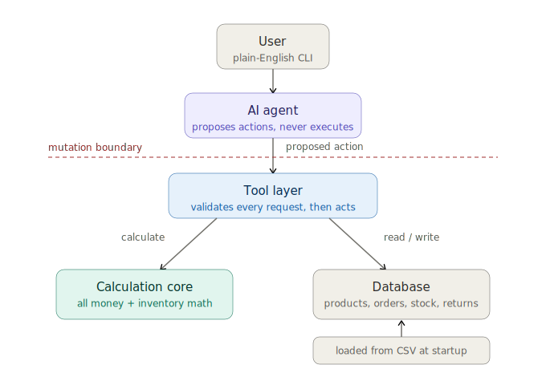

# Retail Store Agent

An interactive CLI agent for a small retail store, backed by a deterministic core, a
validating tool layer, and an OpenAI tool-calling loop. See `WRITEUP.md` for the approach,
and `docs/PRD.md`, `docs/CONTEXT.md`, `docs/adr/` for the full design history.



## Setup

```
pip install -r requirements.txt
```

Add your OpenAI key to `.env`:

```
OPENAI_API_KEY=sk-...
```

## Start the agent

```
python -m agent.cli
```

This bootstraps a fresh in-memory SQLite database from `data/*.csv` and `schema.sql`, then
opens an interactive REPL. Type an instruction, read the reply, keep going — conversation
memory is kept for the whole session, so a follow-up like "now refund that" resolves against
the order you just rang up. Type `exit` to quit.

## Domain model

Schema in `schema.sql`, loaded fresh from the CSVs in `data/` on every run (nothing persists
between sessions). Full glossary in `docs/CONTEXT.md`.

| Table | Holds |
|---|---|
| `products` | One row per sku (product × color × size); `product_id` groups a product's variants |
| `customers` | Named customers who may appear on an order |
| `suppliers` / `supplier_catalog` | Suppliers and their per-product cost + lead time |
| `inventory` | On-hand qty, reorder point, reorder qty — keyed by `sku` |
| `orders` / `order_lines` | Sales, header + line items |
| `returns` | Returns against an existing order line |
| `promotions` | Percent-off promos scoped to a product or a category |
| `purchase_orders` / `purchase_order_lines` | Invented (not in source CSVs) restock orders, keyed by `sku` — see `docs/CONTEXT.md` "Purchase Order" |

## Tool layer

The agent never computes prices, totals, or inventory changes itself — it only calls tools,
each of which validates and resolves references before touching the database. Full schemas
(including nullability rules) are in `agent/schemas.py`.

| Tool | Parameters | Does |
|---|---|---|
| `find_sku` | `product_name`, `color`, `size` | Resolves a product reference to a sku, or returns ambiguous candidates |
| `find_customer` | `name` | Resolves a customer name to a `customer_id`, or null for unknown/walk-in |
| `get_unit_price` | `sku`, `as_of_date` | Promo-adjusted unit price for a sku on a given date |
| `create_sale` | `customer_name`, `lines[]`, `payment_method`, `order_discount_pct`, `order_date` | Rings up a multi-line sale, atomically — rejects the whole sale on ambiguity or insufficient stock |
| `process_return` | `order_id`, `product_name`, `color`, `size`, `quantity`, `condition`, `return_date` | Refunds against an existing order line; rejects over-returns; only good-condition returns restock |
| `create_promotion` | `description`, `value_pct`, `start_date`, `end_date`, `product_name`, `category` | Creates a percent-off promo scoped to exactly one of product or category |
| `get_stockout_report` | — | Lists every sku about to stock out |
| `create_reorder_purchase_orders` | `order_date` | Opens POs for everything flagged, from the cheapest eligible supplier |
| `receive_purchase_order` | `supplier_name`, `product_name`, `color`, `size`, `quantity_received`, `received_date`, `quantity_ordered` | Receives stock against an open PO, or auto-creates one |
| `get_margin_report` | `period`, `top_n` | Top products by profit margin for a period |

## Tests

```
python -m pytest
```

76 unit tests covering `core/`, `tools/`, `agent/session`, and the loader.

An adversarial harness drives the agent through real prompts against the live OpenAI API and
asserts on captured tool calls / DB state (never on prose replies):

```
python -m tests.harness
```

41 cases, 100% pass rate. See `WRITEUP.md` for what it caught.

For prompts with no known-right answer to assert against (rehearsing the kind of broad,
un-assertable run a grader does), `tests/smoke.py` drives the live agent through a list of
prompts and prints a readable transcript for manual review instead:

```
python -m tests.smoke tests/smoke_prompts_full.txt
```
