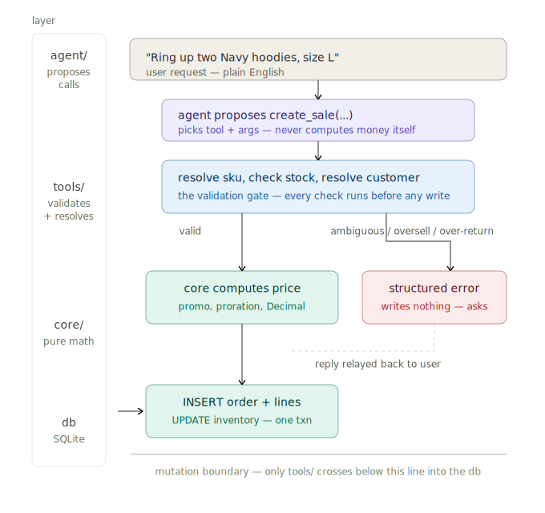

# Writeup

**TL;DR:** Three layers, one mutation boundary — `agent/` proposes, `tools/` is the only code
allowed to touch money or inventory, `core/` is pure math. Getting that boundary right is the
whole point: a bad LLM turn can refuse or ask, but it can never write a wrong number. The
clearest proof this works is a measurement, not a claim — tightening one tool's own description
(not the system prompt) dropped `get_unit_price` calls from **29 to 3** across an identical
82-prompt re-run, structurally removing a failure mode instead of asking the model not to
trigger it. **14 bugs caught by the harness + smoke runs, 0 placeholder-sku calls across 5
independent full live re-runs.**

## 1. Architecture: three layers, one mutation boundary

```
agent/   thin OpenAI tool-calling loop — proposes tool calls, narrates results, never computes
tools/   validates + resolves references + is the ONLY code allowed to touch money or inventory
core/    pure functions — pricing, margin, restocking math — no DB, no I/O
```



`core/` has no side effects at all: `round_half_up`, `prorate_unit_price`, `effective_unit_price`,
`select_supplier`, `days_of_cover`, `compute_product_margins` all take values in and return
values out. `tools/` is where a reference like "the navy hoodie" becomes a `sku`, where a
quantity is checked against `on_hand_qty`, and where the actual `INSERT`/`UPDATE` happens.
`agent/` never writes SQL and never does arithmetic on money or stock.

The boundary matters specifically at *money and inventory mutation* because that's the one
place a wrong LLM decision becomes irreversible and compounding: a hallucinated sku or a
silently-clamped quantity becomes a real row that every later report and reorder decision then
trusts as ground truth. Putting validation there means the worst a bad model turn can do is ask
a clarifying question — never write a wrong number. It's also why `tools/`, not `agent/`, owns
every "ask instead of guess" decision (§2) — the agent can be wrong in prose for free; the tool
layer cannot be wrong in a row.

## 2. Design-decisions log

Load-bearing decisions actually recorded in `docs/CONTEXT.md` and `docs/adr/`, not a restatement
of the brief:

- **Purchase orders are invented, tracked at sku granularity, not product_id.** The CSVs have no
  PO table; `reorder_point`/`reorder_qty` — the real "is this low" signal — live on `inventory`,
  keyed by `sku`. Tracking at `product_id` would mean splitting a reorder quantity evenly across
  variants with no data justifying that split — a correctness bug wearing a design decision's
  clothes. `supplier_catalog` stays keyed on `product_id` (a supplier doesn't price by
  color/size), so a PO line's cost is a lookup via the sku's parent product, not a stored fact.
- **"Flagged" is a disjunction across two different granularities** — a sku below its own
  `reorder_point`, or the product's aggregate days-of-cover under 14 — and reordering a
  product flagged only by the second clause still reorders every sku at its own `reorder_qty`,
  well-defined here only because `reorder_qty` is uniform across variants in this seed data.
- **Ask, don't default, on genuine ambiguity — enforced at the tool boundary, not the prompt.**
  Over-return, oversell, ambiguous sku, an unresolved customer, a promotion with no stated scope:
  every one of these returns a structured error and writes nothing. Deliberately redundant with
  prompt instructions telling the model to ask first — the harness is what confirmed the prompt
  alone wasn't sufficient.
- **Atomicity is now structural, not incidental.** `create_sale`/`process_return` used to be
  atomic only because validation was front-loaded before any write — there was no transaction.
  Both write phases are now wrapped in `with conn:`, so a genuine mid-write failure rolls back
  everything, not just relies on there never being one.
- **An unresolved-but-stated customer name is rejected, not silently walked-in.** `find_customer`
  used to collapse "no name given" (a walk-in) and "a name was given but matched no one" into the
  same `None`. Now `None` means only the former; the latter returns candidates (possibly empty)
  and `create_sale` rejects rather than proceeding as a walk-in — the same "ask, don't default"
  rule applied to a case it had quietly been exempted from.
- **`get_margin_report` validates its own input**, independent of the tool schema's enum — an
  unrecognized period returns a structured `unsupported_period` error rather than a raw
  `KeyError`, so the schema is a convenience for steering the model, not the only thing
  preventing a crash.
- **Cross-turn reference fallback is scoped narrowly** — it only fires for arguments where
  omission already means *missing information* (`order_id`/`product_name` on `process_return`),
  never for `customer_name` on `create_sale`, where omission means **walk-in**, a defined
  business meaning it can never silently overwrite.
- **Margin is period-bounded, not retroactive**, and **only a good/restocked return excludes a
  unit from margin** — a damaged return still refunds revenue but leaves the unit's cost counted.
- **LLM choice (ADR-0002):** `gpt-5.4-mini`, superseding an earlier Groq choice (ADR-0001) once
  an OpenAI key was available — the deciding factor was `strict: true` JSON-schema tool calling,
  which structurally guarantees argument shape before a call ever reaches the tool layer.

## 3. Agent-direction log

**Delegated to the agent:** which tool to call and in what order; filling arguments from natural
language; resolving pronouns/cross-turn references from its own conversation history; deciding
when to ask versus act. **Written directly, never left to the model:** every dollar and
inventory computation, every validation and DB write, the narrow cross-turn fallback, and all
ten tool schemas — the model chooses *which* tool and *what arguments*, the shape of what's
askable was fixed at design time.

**Where agent output was subtly wrong, and how it was caught.** A user says "Ring up two
hoodies," then "Actually make that three." There's no `modify_sale` tool — a sale is final once
rung up. The model's failure mode wasn't a crash; it was *too helpful*: it quietly called
`create_sale` again for one more hoodie, producing two real orders where the user's words
describe one edited order. Nothing looks wrong in isolation — the call succeeds, the reply reads
fine, inventory decrements correctly each time. It only surfaces if you check DB state against
user intent, which is exactly why the harness asserts on tool-call logs and row counts rather
than prose — a prose-reading test suite would never have caught this. Fixed with a system-prompt
addition stating explicitly there's no modify/cancel tool; now a permanent harness case.

The other 13 bugs found the same way, compressed: silently guessing a promotion's scope instead
of asking; crashing on a hallucinated sku, a nonexistent order/sku pairing, or an unrecognized
margin period; treating "grey"/"gray" as different colors; double-ordering stock on a repeated
reorder call; and — the one only a broad *unassertable* smoke run surfaced, not the harness — a
color/size word folded into `product_name` (`"Black Tee"`) defeating the substring match, closed
in both directions (folded-in, and a garbage word landing in the color/size slot itself) via
domain validation against the catalog's own values, never a hardcoded word list.

**The harness's value is what it found, not that it's green.** 41 self-authored cases passing
100% proves less than the fact that building an assertion harness against tool-calls/DB-state
(never prose) surfaced 11 real bugs a prose-reading test suite structurally cannot catch, because
a plausible-sounding reply and a wrong database are indistinguishable from the outside. A
follow-up unassertable smoke run (`tests/smoke.py`, ~80 prompts with no known-right answer, just
human review of the transcript) found 3 more the same way harness assertions can't: a bug only
shows up if someone reads the transcript looking for it.

**A structural fix beats a behavioral instruction — measured.** The model would occasionally
call `get_unit_price` with an invented placeholder sku before `find_sku` resolved a real one —
recoverable, but luck, not design. Tightening the tool's own description (not the system prompt)
to state it's unnecessary before `create_sale` dropped `get_unit_price` calls from **29 to 3**
across an identical 82-prompt re-run — not just the 2 placeholder calls, ~26 other speculative
"preview the price" calls the model made out of habit. Confirmed stable, not a one-off: **0
placeholder/unknown-sku calls across 5 independent full re-runs.**

**Honest time-box note.** This was scoped at ~2 hours; I went well past that deliberately, to
stress correctness against prompts beyond the given 10 rather than trust that 10 samples
generalize to the 115 hidden ones. In a real sprint I'd have stopped at the 41-case harness — the
smoke runs and the domain-validation generalization were depth added to surface correctness
edges, not gold-plating a already-passing feature.

**Stack note.** I know Porter's actual stack is FastAPI + Postgres + React/TS. SQLite here was a
deliberate zero-setup choice for a self-contained, deterministic take-home — same relational
model (tables, foreign keys, transactions), and the schema ports to Postgres largely as-is.

## 4. What's next

- **A below-cost-sale guard.** When an order discount stacked with an active promo would sell a
  unit under its Northwind cost, the agent should warn before ringing it up. This is the exact
  silent margin leak a small-business owner running this from a terminal can't see in a
  spreadsheet — a stacked 20% promo and a 15% loyalty discount on a thin-margin item can quietly
  go net-negative per unit, and nothing today would tell them. Worth building before
  `modify_sale` below — it protects revenue on sales that already happen correctly, rather than
  fixing an edit path most sales never need.
- **A real `modify_sale`/`void_sale` tool.** Editing a completed sale is explicitly out of scope
  today — the agent asks instead of guessing, correct but not a complete answer.
- **Persistent storage across sessions.** The DB rebuilds from CSV in-memory on every run by
  design (deterministic, disposable, right for a take-home). A real deployment wants the loader
  to run once against a durable Postgres instance so sales/returns/POs survive a restart.
- **Multi-currency / multi-store support.** Everything assumes one till, one currency, one
  supplier set — scoping `inventory`/`orders` to a `store_id` and an FX-aware `Decimal` path in
  `core/pricing.py` is the natural next seam.
